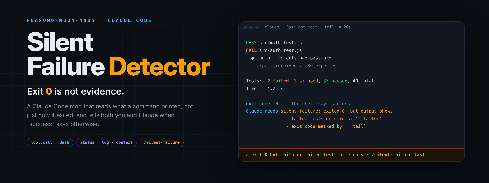
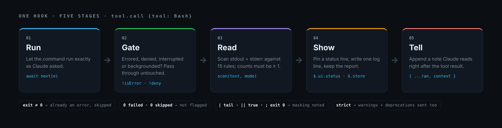

<p align="center">
  
</p>

<p align="center">
  <a href="#start-in-30-seconds"><strong>▶ Start in 30 seconds</strong></a>
  &nbsp;·&nbsp;
  <a href="#see-it-fire"><strong>See it fire</strong></a>
  &nbsp;·&nbsp;
  <a href="#why-this-wins-falsifiable"><strong>Why this wins</strong></a>
  &nbsp;·&nbsp;
  <a href="#worked-ab-2026-10-05-kst"><strong>A/B log</strong></a>
  &nbsp;·&nbsp;
  <a href="docs/ROADMAP.md"><strong>10-mod roadmap</strong></a>
</p>

<p align="center">
  
  
  
  <a href="https://github.com/Reasonofmoon/reasonofmoon-mods/actions/workflows/check.yml"></a>
</p>

---

## The shell's "yes" is not a yes

**reasonofmoon-mods** is a Claude Code plugin marketplace of **mods**: small hooks modules that run inside the Claude Code engine and check what an agent did instead of trusting what it says.

The first mod is the **Silent Failure Detector**. A command can print `2 failed` and still exit `0`: a test runner piped into `tail`, a script ending in `|| true`, a build tool that only warns. The shell reports success. This mod reads the output and says so, both to you and to Claude.

> An exit code answers "did the process end?"  
> **Silent Failure answers "did the work succeed?" — and refuses to let `0` stand in for proof.**

---

## Kernel (one invariant · five stages)

<p align="center">
  
</p>

| You see | What happened | Affordance |
|---------|---------------|------------|
| **Nothing** | Command errored (exit ≠ 0), was denied, interrupted or backgrounded | Claude already knows; the mod stays out of the way |
| **Nothing** | Exit 0 and the output is clean (`0 failed · 0 skipped` counts as clean) | — |
| **⚠ status line** | Exit 0, but the output shows a failure or a skip | `/silent-failure last` for the full report |
| **Dim transcript line** | Same finding, kept in the scrollback | scroll up |
| **Claude's next move** | A note after the tool result: *"exited 0, but its output shows … check before reporting success"* | Claude checks, or explains why it does not matter |

---

<a id="see-it-fire"></a>

## See it fire

A real Claude Code 2.1.289 turn. The script exits 0. These lines are verbatim from the engine's event stream:

```text
ui_status | ⚠ exit 0 but failure: failed tests or errors · /silent-failure last
ui_log    | silent-failure: ./fake-test.sh exited 0 but shows failed tests or errors, FAIL / FAILED marker, tests skipped or pending
result    | No, the test suite did not pass. The script exited 0, but the output shows 2 failed tests out of 40 (35 passed, 3 skipped).
```

Then `/silent-failure last`, run in a **new** session:

```text
⚠ POSSIBLE SILENT FAILURE
Command: ./fake-test.sh
Exit code: 0 (the tool did not report an error)
Detected:
  • [high] failed tests or errors: Tests:       2 failed, 3 skipped, 35 passed, 40 total
  • [high] FAIL / FAILED marker: FAIL src/auth.test.js
  • [warning] tests skipped or pending: Tests:       2 failed, 3 skipped, 35 passed, 40 total
```

It also caught one for real while this repo was being built. A packaging command hit `rsync: command not found` halfway through, kept going, and still ended with exit 0. The mod flagged *command or file not found* before anything was reported as done.

---

## Exit-code trust vs Silent Failure

| | Trusting the exit code | **Silent Failure** |
|--|------------------------|--------------------|
| `npm test \| tail` with 2 failures | ✓ success | **⚠ failure, pipe named** |
| `pytest` with `3 skipped` | ✓ success | **⚠ warning** (shown to you) |
| `make … \|\| true` | ✓ success | **masking named** in the report |
| `0 failed, 0 skipped, 40 passed` | ✓ success | ✓ quiet — zero counts never fire |
| Evidence after the turn | gone with the scrollback | **`/silent-failure last`**, across sessions |
| Who is told | nobody | **you** (status + log) and **Claude** (context) |

---

<a id="worked-ab-2026-10-05-kst"></a>

## Worked A/B (2026-10-05 KST)

We tried to make Claude miss a buried failure, with and without the mod. Each script exits 0 and ends with `Done in 4.2s ✓`.

| Test | Without mod | With mod |
|------|-------------|----------|
| 240-line log, failure at line 121, *"did it all succeed? YES/NO"* | NO ✓ ✓ ✓ | NO ✓ ✓ ✓ |
| 333 KB log, failure at line 2,501, *"write SHIPPED or HOLD"* | HOLD ✓ ✓ ✓ | HOLD ✓ ✓ ✓ |

**Claude was right 12/12 times on its own.** We report that rather than hide it. The mod's value is not that Claude is blind. It is what Claude's answer alone does not give you: a signal **you** see without reading the tool output, a report that **outlives the session**, an **explicit** note to Claude instead of hoping it notices, and the **masking named** (`| tail`, `|| true`).

Full log, scripts and prompts: [`examples/silent-failure/RUN-2026-10-05.md`](examples/silent-failure/RUN-2026-10-05.md)

**Falsifiable takeaway:** if the mod flags text that contains no failure, or misses a line a `high` rule covers, it is wrong. [Open an issue](https://github.com/Reasonofmoon/reasonofmoon-mods/issues) with the command and the output.

---

<a id="start-in-30-seconds"></a>

## Start in 30 seconds

```bash
claude plugin marketplace add Reasonofmoon/reasonofmoon-mods
claude plugin install silent-failure@reasonofmoon-mods
```

Or from inside a session: `/plugin install silent-failure --marketplace Reasonofmoon/reasonofmoon-mods`

**What you get:** the next Bash call that exits 0 with a failure in its output puts `⚠ exit 0 but failure: …` under your prompt.

| Intent | Command |
|--------|---------|
| Status and last finding | `/silent-failure` |
| Full last report | `/silent-failure last` |
| Also flag warnings and deprecations | `/silent-failure strict` |
| Back to default | `/silent-failure on` |
| Pause | `/silent-failure off` |
| Clear report and status line | `/silent-failure clear` |
| Try without installing | `claude --plugin-dir ./plugins/silent-failure` |
| Update | `claude plugin update silent-failure@reasonofmoon-mods` |

Requires **Claude Code 2.1.287 or later** (mods). Tested on 2.1.289. Coding agents: read [AGENTS.md](AGENTS.md) first.

---

## What it reads

| Severity | Rules (15) | `on` (default) | `strict` |
|----------|------------|----------------|----------|
| **high** | `N failed/failing/errors` · `FAIL`/`FAILED` · `npm ERR!` · Python `Traceback` · `Unhandled rejection` · `Error:`/`TypeError:`… at line start · `failed to load/compile/build…` · `command not found` · `No such file` · `Permission denied` · `segfault`/`panicked at` | shown · **sent to Claude** | shown · sent |
| **warning** | `N skipped/pending/todo/xfail` · `no tests found` · `Ran 0 tests` · coverage threshold not met · `exception` | shown | shown · sent |
| **info** | `warning` · `deprecated` | — | shown · sent |

Counts must be **≥ 1**. Only the last 200 KB of output is scanned. Mode and last report live in the plugin's `$.store`, so they survive reloads and new sessions.

### How "exit 0" is known

Claude Code's Bash result record has **no `exitCode` field** (`stdout`, `stderr`, `interrupted`, `backgroundTaskId?`, …). A non-zero exit reaches the `tool.call` hook as `isError: true`. So: not a deny, not an error, not interrupted, not backgrounded ⇒ the shell said success ⇒ read the output.

### Known limits

- **It reads text, not intent.** A command that *prints* old failures (`cat test.log`, `grep FAIL`, a script echoing results) fires too. Seen twice while building this repo. Use `/silent-failure off` while you inspect logs. A viewer allowlist is next on the [roadmap](docs/ROADMAP.md).
- **Bash only.** Other tools (MCP, Agent) are not scanned yet.
- **English output.** Rules match the wording of common English-language tools.

---

## Why this wins (falsifiable)

| Criterion | Read the scrollback | Shell `set -o pipefail` | Settings `PostToolUse` script | **Silent Failure mod** |
|-----------|---------------------|-------------------------|-------------------------------|------------------------|
| Catches exit 0 + printed failure | if you look | ✗ (only pipes) | if you write it | **✓** |
| Tells Claude, in-turn | ✗ | ✗ | ✓ | **✓** |
| Tells you without reading output | ✗ | ✗ | ✗ | **✓ status line** |
| Evidence after the session | ✗ | ✗ | your own log | **✓ `/silent-failure last`** |
| Names the mask (`\| tail`, `\|\| true`) | ✗ | partly | ✗ | **✓** |
| Tests you can run | — | — | rarely | **✓ `claude plugin test`** |

---

## Roadmap → CC Mission Control

Ten mods, one marketplace, eventually one band above the prompt:

```
CTX 61% │ PR 87% │ TEST ✓ │ RISK 12 │ AGENTS 3 │ ⚠ 1
```

| Group | Mods |
|-------|------|
| **VERIFY** | **Silent Failure ✓** · Evidence Mode (next) · PR Readiness |
| **PROTECT** | Undo Guardian · Danger Meter |
| **THINK** | Instruction Conflict Radar · Stop Me If I'm Wrong · Spec vs Reality |
| **ORCHESTRATE** | Agent Conflict Detector · Handoff |

→ [docs/ROADMAP.md](docs/ROADMAP.md)

---

## Layout

```
.claude-plugin/marketplace.json   the catalog `claude plugin marketplace add` reads
plugins/silent-failure/           plugin.json · hooks/register.ts · tests/ · README
examples/silent-failure/          real-run log · A/B scripts
docs/                             ROADMAP · assets (rendered from docs/src/*.html)
scripts/check.sh                  strict validate + tests (CI runs this)
```

Zero runtime dependencies. The hooks module runs inside Claude Code's own mod environment: no Node, no build step.

---

## 한국어 요약

**종료 코드 0은 성공의 증거가 아닙니다.** `npm test | tail`처럼 테스트가 실패해도 exit 0으로 끝나는 명령이 있습니다. 이 Mod는 Claude Code가 Bash를 실행할 때마다 출력을 읽습니다. 실패나 skip이 보이면 프롬프트 아래 상태줄로 사용자에게 알리고, 도구 결과 뒤에 메모를 붙여 Claude에게도 알립니다.

- 설치: `claude plugin marketplace add Reasonofmoon/reasonofmoon-mods` → `claude plugin install silent-failure@reasonofmoon-mods`
- 명령: `/silent-failure` · `last` · `strict` · `on` · `off` · `clear`
- 정직한 실험 결과: 묻힌 실패를 Claude가 Mod 없이도 12번 중 12번 찾아냈습니다. 이 Mod의 가치는 Claude가 놓치는 것을 잡는 데 있지 않습니다. 사용자가 출력을 보지 않아도 알 수 있고, 세션이 끝나도 증거가 남고, Claude에게 명시적으로 전달되며, 종료 코드를 가리는 구문(`| tail`, `|| true`)을 짚어 준다는 점입니다.

---

## License

MIT · Reason of Moon
